## Как запустить
Для запуска docker контейнера с базой данных использовать команду:

    make up-db

Для запуска миграции базы данных использовать команду (предварительно поднять базу):

    make migrate

Для запуска генерации ключей использовать команду:

    make keys-generate

Для запуска Server использовать команду (предварительно поднять базу):

    go run cmd/server/main.go

Для запуска Client использовать команду:

    go run cmd/client/main.go

## Запуск тестов:

Для запуска тестов и проверки покрытия использовать команду:

    make test

## Генерации:

Для запуска генерации proto-api использовать команду:

    make api-generate

Для запуска генерации ключей использовать команду:

    make keys-generate

Для запуска генерации моков использовать команду:

    make mocks-generate

### Аргументы и флаги
#### Для client
Host - адрес эндпоинта HTTP-сервера.

    Флаг -host. 
    Значение по умолчанию "localhost:8080". 
    Переменная окружения HOST.

#### Для server
Host - адрес эндпоинта HTTP-сервера.

    Флаг -host. 
    Значение по умолчанию "localhost". 
    Переменная окружения HOST.

Port - порт.

    Флаг -port. 
    Значение по умолчанию ":8080". 
    Переменная окружения PORT.

DatabaseDsn - строка с адресом подключения к БД.

    Флаг -dsn. 
    Значение по умолчанию "host=localhost port=5432 user=mila dbname=goph_keeper password=qwerty sslmode=disable". 
    Переменная окружения DATABASE_DSN.

JwtKey - ключ для хеша.

    Флаг -jwt-key. 
    Значение по умолчанию "popa". 
    Переменная окружения JWT_KEY.

CryptoKey - путь до файла с публичным ключом.

    Флаг -crypto-key. 
    Значение по умолчанию "./crypt/server.key". 
    Переменная окружения CRYPTO_KEY.

CryptoCrt - путь до файла с сертификатом.

    Флаг -crypto-crt. 
    Значение по умолчанию "./crypt/server.crt". 
    Переменная окружения CRYPTO_CRT.

## Особенности реализации
Для реализации клиента используется TUI (github.com/rivo/tview). 
Для коммуникации между страницами TUI используется модель подписок.

Для клиент-серверного взаимодействия используется grpc + protobuf + https. 
Для реализации авторизации и аутентификации используется JWT token (github.com/golang-jwt/jwt/v5).

В качестве базы данных используется Postgres последней версии. 
Для миграций используется goose (github.com/pressly/goose), а в качестве доступа к базе данных (ORM) используется GORM (gorm.io/gorm).
Схему базы данных можно посмотреть в ./migration.

### Шифрование
Шифрование используется на стороне клиента для шифрования критичных данных.
Данные передаются на сервер в уже зашифрованном виде и записываются напрямую в базу данных.
Расшифровать данные без клиента невозможно.

Шифрование используется алгоритм AES.
Ключ шифрования генерируется на основе пароля и соли с использованием PBKDF2 с алгоритмом SHA256.

### Синхронизация
Синхронизация осуществляется путем клиент-серверного взаимодействия, при каком либо действии пользователя происходит обновление данных.
Данных хранятся на стороне сервера.

## Руководство пользования
### Регистрация
При запуске приложения открывается страница авторизации:

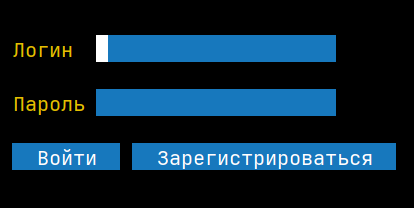

Для того чтобы зарегистрироваться, необходимо нажать кнопку "Зарегистрироваться", откроется окно для регистрации с полями "Логин" и "Пароль".
После их указания необходимо нажать кнопку "Зарегистрироваться".

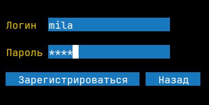

После успешной регистрации открывается форма авторизации.

### Авторизация
При запуске приложения открывается страница авторизации.

Для того чтобы авторизоваться, необходимо ввести свой "логин" и "пароль", нажать кнопку "Войти".

После авторизации откроется главное меню:

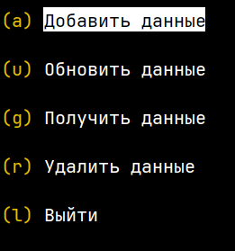

### Запись новых данных
Для того чтобы добавить новую запись, необходимо в главном меню выбрать пункт "Добавить данные".

Откроется список типов данных, которые можно создать.

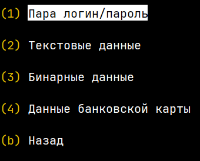

После выбора одного из типов открывается соответствующая форма.

Тип "Пара логин/пароль"

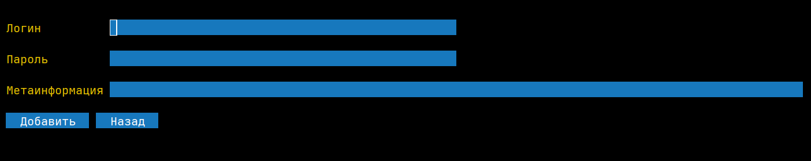

Тип "Текстовые данные"

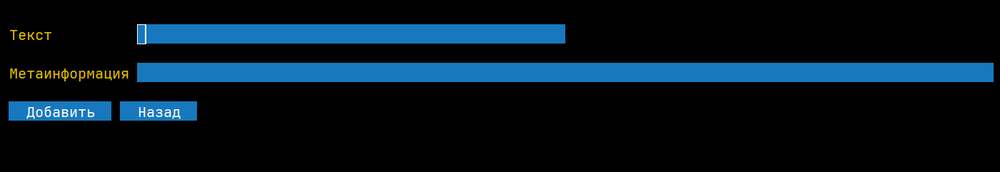

Тип "Бинарные данные"

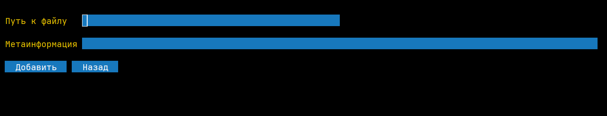

Тип "Данные банковской карты"

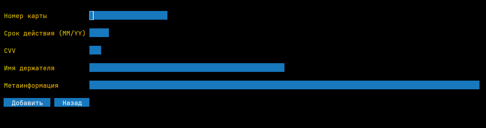

После ввода информации в поля, необходимо нажать кнопку "Добавить" для сохранения.
### Просмотр существующих записей
Для просмотра уже созданных записей необходимо в главном меню выбрать пункт "Получить данные". Отобразится список всех существующих записей.

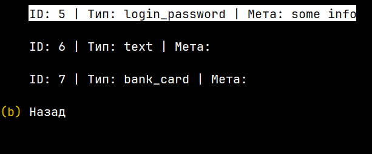

Для просмотра детальной информации необходимо выбрать конкретную запись.

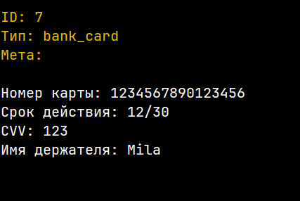

### Редактирование записей
Для редактирования записи необходимо в главном меню выбрать пункт "Обновить данные".
Отобразится список всех существующих записей. Для редактирования необходимо выбрать конкретную запись.

Откроется форма с соответствующим типом данных. После внесения изменений необходимо нажать кнопку "Сохранить".

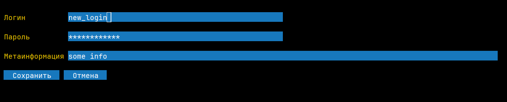

### Удаление записей
Для удаления записи необходимо в главном меню выбрать пункт "Удалить данные".
Отобразится список всех существующих записей. Для удаления необходимо выбрать конкретную запись.

Откроется окно подтверждения удаления записи.

